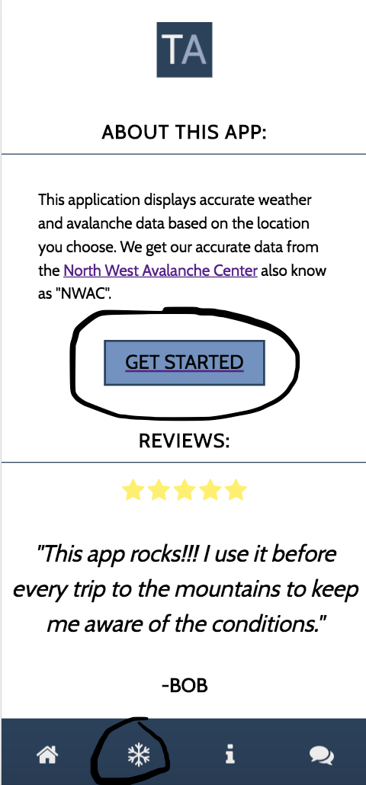
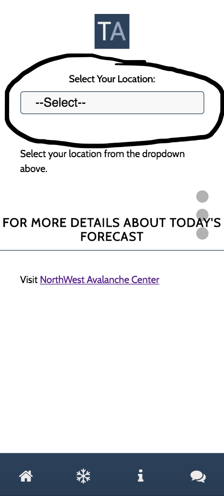
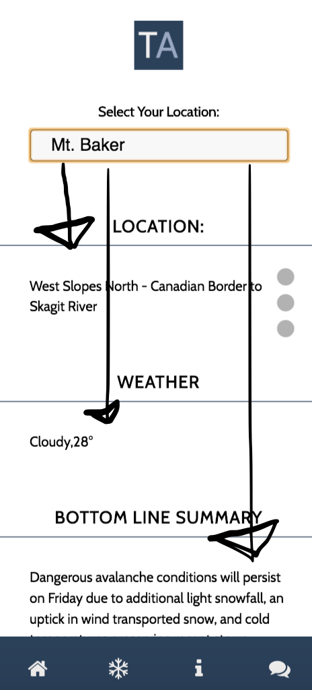
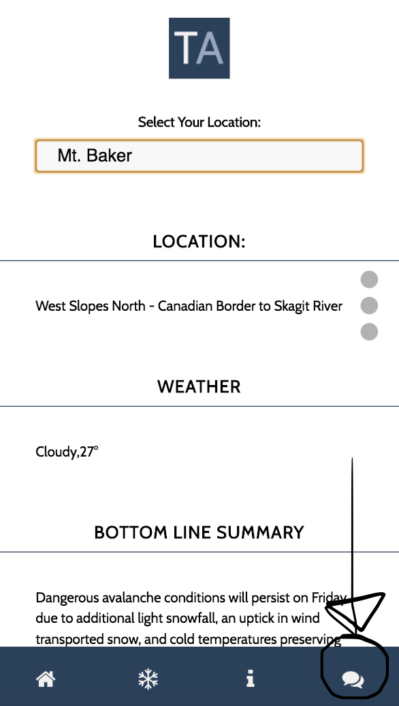
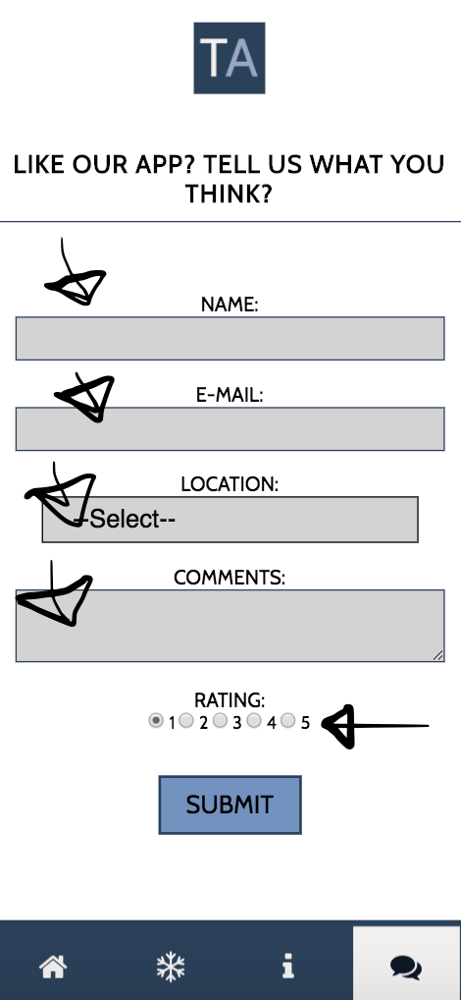
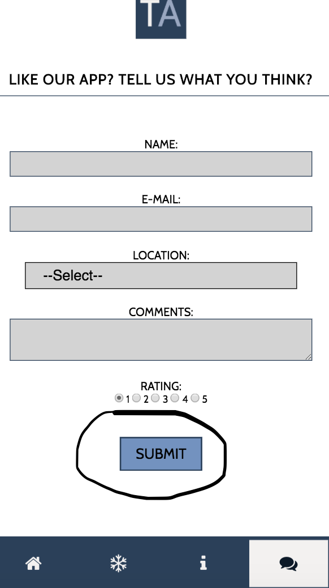

=======
**Team Avalanche App**
=======

## Table of Contents
* [Team Avalance Members](#)
* [Technologies Used](#technologies)
* [How to use this App](#how-to-use)
  * [Homepage](#homepage)
  * 
* [More Project Details](#details)

# Team Members
* "Alicia Lycan" <https://github.com/alicialycan>
* "Amber Kim" <https://github.com/amgranad>
* "Arthur Allen" <https://github.com/ErmineNotyours>
* "Brandon Buchholz" <https://github.com/bjbuchholz>

## Technologies
* **Front-end**: [JavaScript](https://developer.mozilla.org/en-US/docs/Web/JavaScript),  [HTML5](https://developer.mozilla.org/en-US/docs/Web/Guide/HTML/HTML5), [CSS3](https://developer.mozilla.org/en-US/docs/Web/CSS/CSS3), [Page.js](https://visionmedia.github.io/page.js/), [Handlebars](http://handlebarsjs.com/)

* **Back-end**: [Node.js](https://nodejs.org/en/),  [Express](https://www.npmjs.com/package/express), [Super Agent](https://www.npmjs.com/package/superagent), [Heroku](https://heroku.com/), [PostgreSQL](https://www.postgresql.org/), [Body Parser](https://www.npmjs.com/package/body-parser), [Cors](https://www.npmjs.com/package/cors), [Request](https://www.npmjs.com/package/request), [Cheerio](https://www.npmjs.com/package/cheerio)

* **Other**: MVC, RESTful API

## How to Use This Team Avalanche App
#### Homepage

##### Getting your forecast information

1. Press the "Get Started" button above or select the Snowflake from the menu at the bottom.

2. Next, you will select the region you want to display. Once the location is chosen you will see current weather/avalanche information directly from "NWAC" It's that easy!!!!

##### Leaving your feedback

3. To leave your review or user feedback, click on the Comments Icon on the bottom right.

4. Fill in your information on the form (please don't leave any sensitive information!). Your review will populate with other reviews randomly on the home page.

5. Click "Submit" and you will be taken to a thank you page.

#  More Project Details

## Project Topic
A mobile-first web app that displays quick avalanche risk region information.

## Problem to be Solved
The Northwest Avalanch Center provides up-to-date and accurate information for people who want to explore the mountain areas but there is a lot of information that can be harder or more time consuming to navigate through or try to understands.

## Benefits:
* Quick overview of a region's conditions.

## Misc.
* 

# Special Thanks to
* [Northwest Avalanch Center](https://www.nwac.us/) for letting our team use their API!
* [Nicolas Gallagher](https://github.com/necolas) for normalize.css
* [Font Awesome by Dave Gandy](http://fontawesome.io) for Font Awesome icons.
* [Dot Navigation by Chris](https://codepen.io/zuhloobie/pen/RaLJOK) See the side navigation on our Forecast page.
* [Animate.css](https://daneden.github.io/animate.css/) Page animations.
